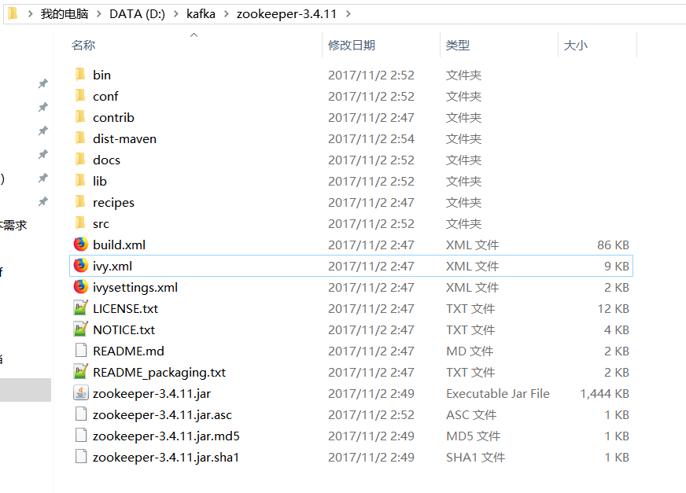
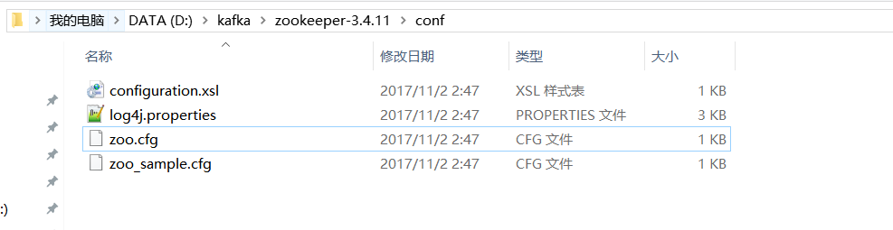

## Kafka笔记

### 首先去官网下载kafka_2.11-1.0.0.tgz

【官网地址】https://kafka.apache.org/


### 解压kafka_2.11-1.0.0.tgz


### 下载zookeeper-3.4.11.tar.gz
【官网地址】http://zookeeper.apache.org/


### 解压zookeeper-3.4.11.tar.gz


### 修改zookeeper配置文件


zoo.cfg
```
# The number of milliseconds of each tick
tickTime=2000
# The number of ticks that the initial
# synchronization phase can take
initLimit=10
# The number of ticks that can pass between
# sending a request and getting an acknowledgement
syncLimit=5
# the directory where the snapshot is stored.
# do not use /tmp for storage, /tmp here is just
# example sakes.
dataDir=/tmp/zookeeper
# the port at which the clients will connect
clientPort=2181
# the maximum number of client connections.
# increase this if you need to handle more clients
#maxClientCnxns=60
#
# Be sure to read the maintenance section of the
# administrator guide before turning on autopurge.
#
# http://zookeeper.apache.org/doc/current/zookeeperAdmin.html#sc_maintenance
#
# The number of snapshots to retain in dataDir
#autopurge.snapRetainCount=3
# Purge task interval in hours
# Set to "0" to disable auto purge feature
#autopurge.purgeInterval=1

```


### 启动zookeeper
> ./zkServer.sh start-foreground

> start-foreground表示以前台方式启动(即当关闭窗口服务将停止)


